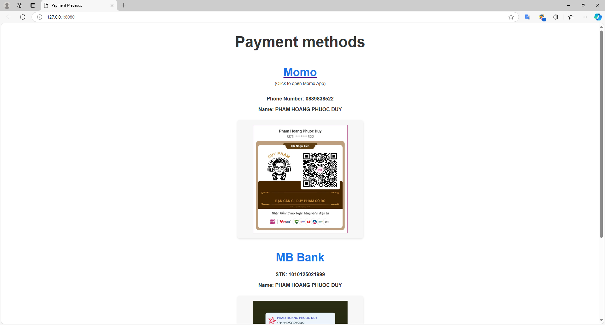

# Ktor Payment QR Server

A Ktor web server designed to streamline bank transfers by displaying payment QR codes. Simply share this website with anyone who wants to send you money, and they can either scan the QR code with their banking app or tap it to open their app directly with pre-filled payment details for an easy, fast transaction.

## ✨ Features

- **QR Code Display**: Clean, responsive interface for displaying payment QR codes.
- **Quick Payment**: One-tap solution to open banking apps with pre-filled payment details.
- **Cross-Platform**: Works seamlessly across desktop and mobile devices.
- **Responsive Design**: Optimized layout for various screen sizes.

## 🛠️ Tech Stack

- **[Kotlin](https://github.com/JetBrains/kotlin)**: Modern, concise programming language.
- **[Ktor](https://github.com/ktorio/ktor)**: Lightweight web framework for Kotlin.
- **[FreeMarker](https://ktor.io/docs/server-freemarker.html)**: Template engine for dynamic content.
- **[Ktor Resources](https://ktor.io/docs/server-resources.html)**: Type-safe routing plugin.

## 🚀 Getting Started

### Prerequisites

- Java 11 or higher
- Gradle (included in wrapper)

### Installation

1. Clone the repository.

2. Replace QR code images:
   - Navigate to `src/main/resources/static/`
   - Replace existing QR images with your own

### Running the Server

1. Start the server using Gradle:
   ```bash
   ./gradlew run
   ```

2. Access the application:
   - Open your browser
   - Navigate to [http://localhost:8080/](http://localhost:8080/)
   - Default port is 8080 (configurable in application.yaml)

## 📱 Screenshots

### Desktop View


### Mobile View


## 🔧 Configuration

### Port Configuration
To change the default host and port (8080), modify `application.yaml`:

```yaml
ktor:
  application:
    modules:
      - com.helios.web.quick_pay.ApplicationKt.main
  deployment:
    port: 8080
    host: 0.0.0.0

```

## Deployment
The server is hosted on my [Raspberry Pi 5](https://www.raspberrypi.com/products/raspberry-pi-5/) and deployed at https://payment.phpduy.info, thanks to [Cloudflare Tunnel](https://www.cloudflare.com/en-gb/products/tunnel/).

## 📄 License

This project is licensed under the MIT License - see the [LICENSE](LICENSE) file for details.
